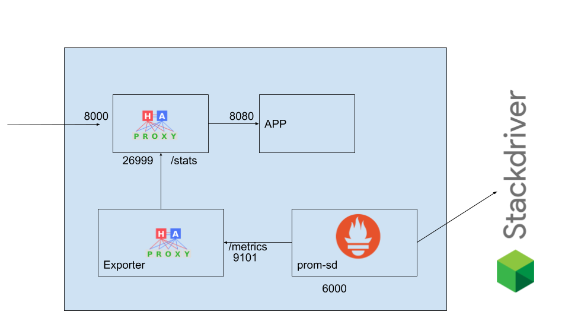
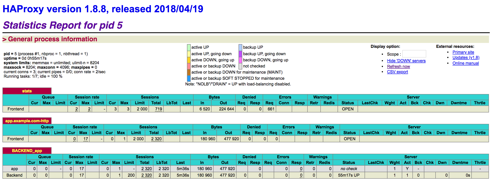
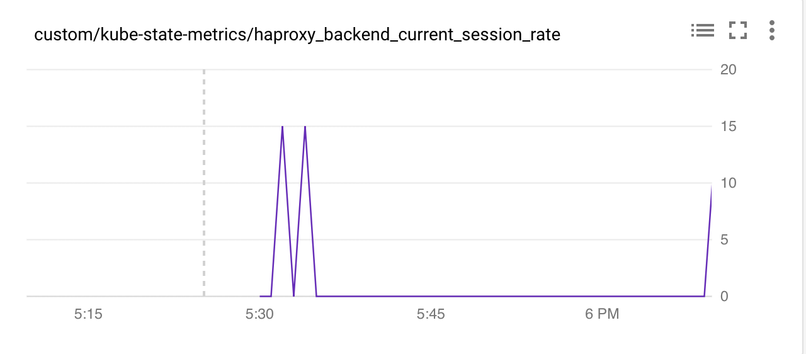

# HAPROXY PROM SD

## Plan



## Excecute

```shell
 kubectl create configmap haproxy-cfgmap --from-file=haproxy.cfg --dry-run -o yaml > haproxy-configmap.yaml

 kubectl apply -f haproxy-configmap.yaml
 kubectl apply -f haproxy.yaml
 ```

 ```shell
$ kubectl get pods --selector "run=haproxy-server" -o jsonpath='{.items[*].metadata.name}'
haproxy-server-74f648d85-xbkrj
```

## Verify APP Being Proxy'd

```shell
$ kubectl port-forward `kubectl get pods --selector "run=haproxy-server" -o jsonpath='{.items[*].metadata.name}'` 8000:8000
Forwarding from 127.0.0.1:8000 -> 8000
```

```shell
$ curl 127.0.0.1:8000
Hello, world!
Version: 1.0.0
Hostname: haproxy-server-f86d9db4d-jmsfb
```

## Verify stats

```shell
$ kubectl port-forward `kubectl get pods --selector "run=haproxy-server" -o jsonpath='{.items[*].metadata.name}'` 26999:26999
Forwarding from 127.0.0.1:26999 -> 26999
```



## Verify /metrics

```shell
$ kubectl port-forward `kubectl get pods --selector "run=haproxy-server" -o jsonpath='{.items[*].metadata.name}'` 9101:9101
Forwarding from 127.0.0.1:9101 -> 9101
```

```shell
$ curl 127.0.0.1:9101
<html>
             <head><title>Haproxy Exporter</title></head>
             <body>
             <h1>Haproxy Exporter</h1>
             <p><a href='/metrics'>Metrics</a></p>
             </body>
             </html>
$ curl 127.0.0.1:9101/metrics | tail
  % Total    % Received % Xferd  Average Speed   Time    Time     Time  Current
                                 Dload  Upload   Total   Spent    Left  Speed
100 19934  100 19934    0     0   321k      0 --:--:-- --:--:-- --:--:--  324k
process_open_fds 9
# HELP process_resident_memory_bytes Resident memory size in bytes.
# TYPE process_resident_memory_bytes gauge
process_resident_memory_bytes 1.073152e+07
# HELP process_start_time_seconds Start time of the process since unix epoch in seconds.
# TYPE process_start_time_seconds gauge
process_start_time_seconds 1.52591208585e+09
# HELP process_virtual_memory_bytes Virtual memory size in bytes.
# TYPE process_virtual_memory_bytes gauge
process_virtual_memory_bytes 1.6560128e+07
```

## Bootstrap stack driver

On GKE, you need cluster-admin permissions on your cluster. You can grant your user account these permissions with following command:

```shell
kubectl create clusterrolebinding cluster-admin-binding --clusterrole cluster-admin --user $(gcloud config get-value account)
```

Start Custom Metrics - Stackdriver Adapter.

```shell
kubectl apply -f https://raw.githubusercontent.com/GoogleCloudPlatform/k8s-stackdriver/master/custom-metrics-stackdriver-adapter/deploy/production/adapter.yaml
```

## Consume


